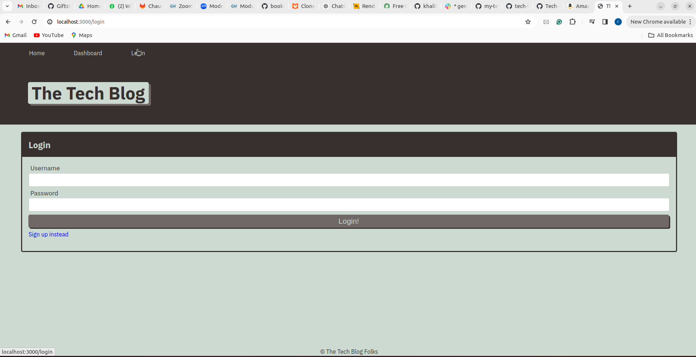
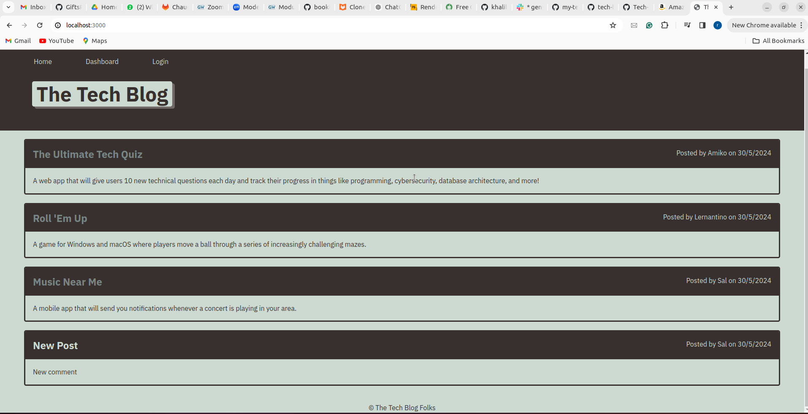

# module14

# Tech Blog

## Description
Tech Blog is a web application that allows users to create, edit, and view blog posts. It uses Node.js, Express, Sequelize, and Handlebars.

## Table of Contents
- [Installation](#installation)
- [Usage](#usage)
- [Screenshot](#screenshot)
- [License](#license)
- [Contributing](#contributing)
- [Questions](#questions)

## Installation
To install the necessary dependencies, run the following command:
```bash
npm install
```

## Usage
To start the application, use the following command:
```bash
npm start
```
To seed the database with sample data, run:
```bash
npm run seed
```
## Screenshot
Here is a screenshot of the application:





## License
This project is licensed under the ISC license.

## Contributing
Contributions are welcome! Please open an issue or submit a pull request.

## Questions
If you have any questions about the project, please contact the project [owner](https://github.com/khalilhusnain).